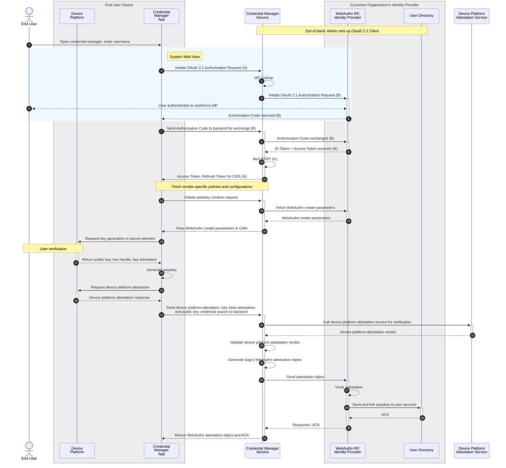

# WebAuthn Direct Registration for Workforce (WDR4W)

- Author: @timcappalli
- Last Updated: 2026-06-03
- Status: Early draft for discussion

## Motivation, Background, and Goals

> #TODO: Need an opening blurb here.

### Goals

1. Address user experience challenges relating to unique workforce security requirements
2. Provide a secure and interoperable pattern for enrolling attested, device-bound passkeys in the workforce
3. Provide a path towards certification for back-channel passkey enrollment in workforce deployments

### Non-Goals

1. Define new behaviors for WebAuthn Get Assertion flows
2. Address consumer deployments or scenarios
3. Support the creation and management of synced passkeys

## Terminology

- Credential Manager (CM): a piece of software responsible for creating, managing, and mediating use of credentials, such as passkeys.
- Managed Credential Manager (MCM): a credential manager which is managed by an organization.
- Credential Manager Application (CMA): a specific application which has credential management capabilities. For the purposes of this document, the CMA is a Managed Credential Manager (MCM).
- Credential Manager Service (CMS): the backend or remote service supporting the Credential Manager Application (CMA).
- Device Platform Attestation: a platform-specific attestation statement containing details about the calling app (no relationship to WebAuthn Attestation)
- Enterprise Attestation (EA): an attestation pattern which allows the authenticator/credential manager to provide a unique identity
- WebAuthn Attestation Object: a package of data [defined in WebAuthn](https://www.w3.org/TR/webauthn-3/#attestation-object) which carries the result of a WebAuthn create ceremony.
- WebAuthn Relying Party (WRP): the entity whose web application or native app utilizes the WebAuthn API, typically an identity provider. See [webauthn-3](https://www.w3.org/TR/webauthn-3/#relying-party).
- Unmanaged device: an end user device where an organization has no administrative access to monitor or enforce device-level security policies.

> #TODO: Align these definitions with the FIDO2 TWG Credential Manager Subgroup

## Proposed Solution

### Overview

This proposed solution leverages a relationship between the Credential Manager vendor and the , loosely inspired by patterns in use today by hardware security key vendors, where passkeys can be pre-provisioned onto security keys prior to distribution to end users.

> #TODO: Expand the overview

### Assumptions

- The organization operating the WebAuthn Relying Party has a business relationship with the Credential Manager vendor
- The Credential Manager vendor is responsible for securing communication between the Credential Manager App (CMA) and Credential Manager Service (CMS)
- The Credential Manager Service (CMS) is an OAuth 2.0 Confidential Client registered with the identity provider for the WebAuthn Relying Party (WRP)
- The Credential Manager Service (CMS) talks directly to the WebAuthn Relying Party to update user records
- The passkey being created is an attested, device-bound passkey
- The Credential Manager Service (CMS) is stateless in terms of the passkeys themselves (e.g. only brokers the enrollment)
- This pattern uses Enterprise Attestation
- The end user has an unmanaged device (does not exclude this pattern from being used on managed devices, though)
- The WebAuthn Relying Party and Identity Provider are logically the same component

### Details

> NOTE: Typically the WebAuthn RP (WRP), Identity Provider (IdP), User Directory (UD), OpenID Provider (OP), and OAuth 2.0 Authorization Server (AS) are components/modules of one logical service. For illustrative purposes, some of these are expanded out into discrete components, wrapped into a box representing the logical service.

Out of band, the WebAuthn Relying Party (WRP) admin configures an OAuth 2.1 Client with the Credential Manager vendor.

1. An End User downloads their organization's workforce Credential Manager App (CMA) from an app store, launches the app, and enters their fully qualified username when prompted.
2. The CMA invokes a system web view with an OAuth 2.1 Authorization Request (A) to the Credential Manager Service (CMS).
3. The CMS does an internal lookup to discover the identity provider for the fully qualified username the End User entered
4. The CMS initiates an OAuth 2.1 Authorization Request (B) to the organization's IdP.
5. The End User authenticates to the workforce identity provider (out of scope).
6. The IdP returns an authorization code (B) to the CMA.
7. The CMA sends the authorization code (B) to the CMS.
8. The CMS exchanges the authorization code with the IdP (authorization server).
9. The IdP (AS) returns an ID Token (B) and Access Token (B).
10. The CMS verifies the ID Token (B) and mints an Access Token (A) for the CMA.
11. The CMS returns the Access Token (A) to the CMA.
12. The CMA initiates a passkey creation request to the CMS.
13. The CMS requests the appropriate WebAuthn create parameters from the WebAuthn Relying Party (WRP).
14. The WRP replies with the appropriate parameters for the user.
15. The CMS returns the WebAuthn parameters to the CMA.
16. The CMA invokes a Device Platform API to request key generation in a secure element. The End User is asked to perform device-level User Verification.
17. The Device Platform returns the public key and additional metadata, such as a key/keystore attestation.
18. The CMA creates a passkey (public key credential source) using the previously generated key.
19. The CMA requests a platform attestation for app provenance.
20. The Device Platform returns a platform-specific attestation.
21. The CMA packages and sends the previously created elements (passkey, key store attestation, platform attestation) to the CMS.
22. The CMS calls the Device Platform Attestation Service (DPAS) requesting a verdict for the platform attestation.
23. The DPAS responds with a verdict.
24. The CMS validates the attestation verdict.
25. The CMS generates a WebAuthn attestation object using its attestation signing keys.
26. The CMS makes a request to the WRP to link the passkey to the user object.
27. The WRP validates the WebAuthn attestation.
28. The WRP stores and links the passkey to the user object.
29. The WRP responds with a success message.
30. The CMS returns the WebAuthn attestation object and a success message to the CMA.

## Open questions

### High Level and Architectural

- Should we use terminology like "instance" to better illustrate a specific install/instance of the app? e.g. "Credential Manager App Instance".
- App attestation is currently defined as part of the passkey generation part of the flow. It is likely that the CMS will also use app attestation to secure its APIs. Should this just be collapsed into the first OAuth exchange?
- In general, what should this document look like from a structure standpoint? Is it a protocol? Profile? Pattern? All of the above?
  - ex: we should probably have a bare minimum security bar for the CMA and CMS communication.
- This gets into lifecycle, but we may want to address it: if the Credential Manager Service believes the Credential Manager App instance is no longer trusted, what should happen?

### Deeper Technical Details for Future Discussion

- What should the origin be?
- Should there be an indication that this is a back channel request in clientData (or somewhere else)?
- What should the UV bit be set to, since the attestation object generation happened in the CMS?

## Changelog

### 2026-06-03

- Design Decision: CMS to WRP request is now delegated (user's context instead of service account)
- Add additional detail around OAuth 2.1 flows (authorization code, code exchange, etc)
- Diagram: System Web View box updated to end after authorization code is returned
